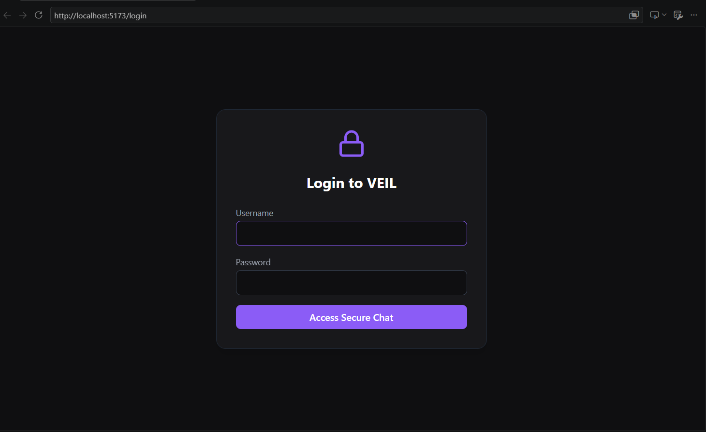
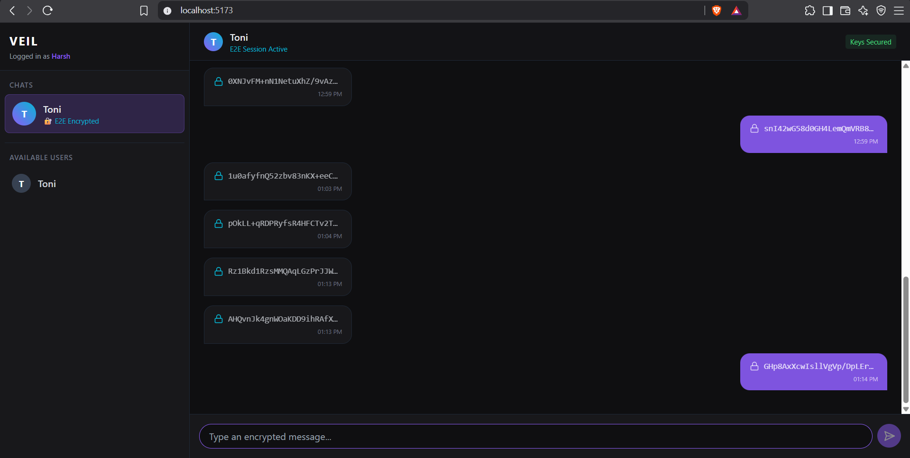
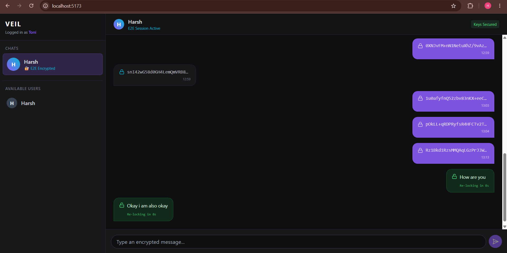

# VEIL 🔐

> **Messages are visible. Their meaning isn't.**

VEIL is a real-time, end-to-end encrypted (E2EE) messaging application built with zero-knowledge principles. Messages are displayed as scrambled ciphertext by default, even to the sender. Plaintext is only revealed locally upon explicit interaction and is automatically destroyed from memory after 10 seconds or when the application loses focus.

---

## 📸 Screenshots
*(Add your screenshots here: Login screen, Chat Interface with Ciphertext, and a Decrypted Message showing the 10-second timer)*

---

## ✨ Features

* **True E2E Encryption:** Messages are encrypted in the browser using the Web Crypto API (AES-256-GCM) and `@noble/curves` (X25519). Private keys never leave the local device.
* **Volatile Decryption UI:** The core "VEIL" feature. Click a message to decrypt it locally. The plaintext self-locks after a strict 10-second countdown.
* **Anti-Shoulder Surfing:** Strict window visibility locks. If you switch tabs or minimize the browser, all decrypted messages instantly turn back into ciphertext.
* **Real-Time Delivery:** Lightning-fast message routing via WebSockets.
* **Secure Authentication:** Argon2id password hashing and HTTP-only cookies.
* **Zero-Knowledge Backend:** The server database only stores ciphertext, nonces, and public keys. It cannot read any conversations.

---

## 🏗️ Architecture & Cryptography Flow

VEIL uses a client-server architecture where the Fastify server acts purely as a message router and public-key directory. 

1. **Key Generation:** On first login, clients generate an `X25519` key pair. The private key remains in `localStorage`. The public key is uploaded to the server.
2. **Key Agreement:** Client A fetches Client B's public key and computes a shared secret via `ECDH`.
3. **Key Derivation:** The shared secret is passed through `HKDF-SHA256` to derive an `AES-256-GCM` symmetric key.
4. **Encryption:** Client A encrypts the plaintext with a unique 12-byte Nonce.
5. **Transit:** The Server receives and routes *only* the ciphertext and nonce.
6. **Decryption:** Client B uses their derived AES key to decrypt the ciphertext locally inside the React component state.

---

## 🛠️ Tech Stack

* **Frontend:** React, TypeScript, Vite, Tailwind CSS, Zustand, React Router
* **Backend:** Node.js, Fastify, TypeScript, WebSockets (`ws`)
* **Database:** PostgreSQL (via Docker), Prisma ORM
* **Cryptography:** Web Crypto API, `@noble/curves`
* **Testing:** Vitest

---

## 🚀 Installation & Setup

### Prerequisites
* Node.js (v20+)
* Docker Desktop (for PostgreSQL database)
* Git

### 1. Clone the Repository
```bash
git clone [https://github.com/YOUR_USERNAME/veil.git](https://github.com/YOUR_USERNAME/veil.git)
cd veil
```
### 2. Install Dependencies
```bash
npm install
```
### 3. Environment Variables

## Copy the example environment file and set your secure session secret:
```bash
cp .env.example .env
```
### 4. Database Setup

## Start the PostgreSQL container and run Prisma migrations:
```bash
docker compose up -d
npx prisma migrate dev --name init
npx prisma db seed
```
# (Note: The seed script creates two test users: Harsh and Toni with passwords harsh_dev_password and toni_dev_password).

### 5. Run Development Servers
```bash
npm run dev
```
# Access the application at http://localhost:5173.

### 🧪 Testing

## VEIL includes an automated cryptographic test suite to mathematically prove that the encryption is sound, keys derive correctly, and tampered messages are rejected.
```bash
npm run test --workspace=apps/web
```

### 🤝 Contributing (Open Source)

## VEIL is an open-source project and we welcome contributions from the community! Whether it's fixing a bug, improving the UI, or building a complex cryptographic feature, your help is appreciated.

# How to Contribute:

* Fork the repository.

* Clone your fork locally.

* Create a new branch for your feature: git checkout -b feature/your-feature-name

* Commit your changes: git commit -m "Add some feature"

* Push to the branch: git push origin feature/your-feature-name

* Open a Pull Request against the main branch.

## Please ensure that any cryptographic changes include passing tests in crypto.test.ts and rely on standard audited APIs.

### 🗺️ Roadmap & Good First Issues

## Looking for something to build? Here are some features we want to bring to VEIL:

* [ ] Perfect Forward Secrecy: Implement the Double Ratchet Algorithm to replace our static AES key derivation.

* [ ] Group Chats: Implement Sender Keys architecture for encrypted N-way messaging.

* [ ] Media Sharing: Add support for encrypting and sending images/files as binary blobs.

* [ ] Burn-on-Read: A feature to permanently delete messages from the database after the 10-second decryption window closes.

* [ ] PWA Support: Make VEIL installable as a Progressive Web App for offline access.

### 🛡️ Security Disclaimer

## VEIL is a robust demonstration of E2E principles and zero-knowledge architecture. However, it is an open-source project in active development. It does not currently implement Perfect Forward Secrecy and relies on static identity keys. Use for educational and developmental purposes.

### 📄 License
This project is licensed under the MIT License.



